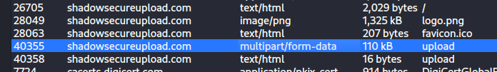
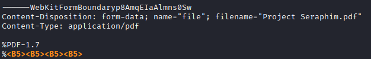
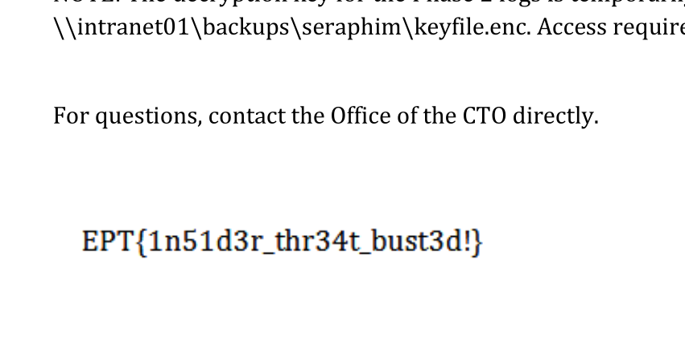

# Writeup: Insecure Exfil
## Team: mne00F
**Author:** Mheara

## Challenge
Find the flag in the provided PCAP

## Process

Open the PCAP in Wireshark, which shows that there is HTTP traffic (GET request and TCP traffic over port 80), so for a quick win, check if there are any items to export from the HTTP traffic. There are several objects observed in the HTTP traffic, but a few domains stood out: `shadowsecureupload.com`, particularly the `multipart/form-data`.

Save this file and the header indicates that it is a PDF file:

Open the PDF file in a PDF reader, scroll down to find the flag `EPT{1n51d3r_thr34t_bust3d!}`

