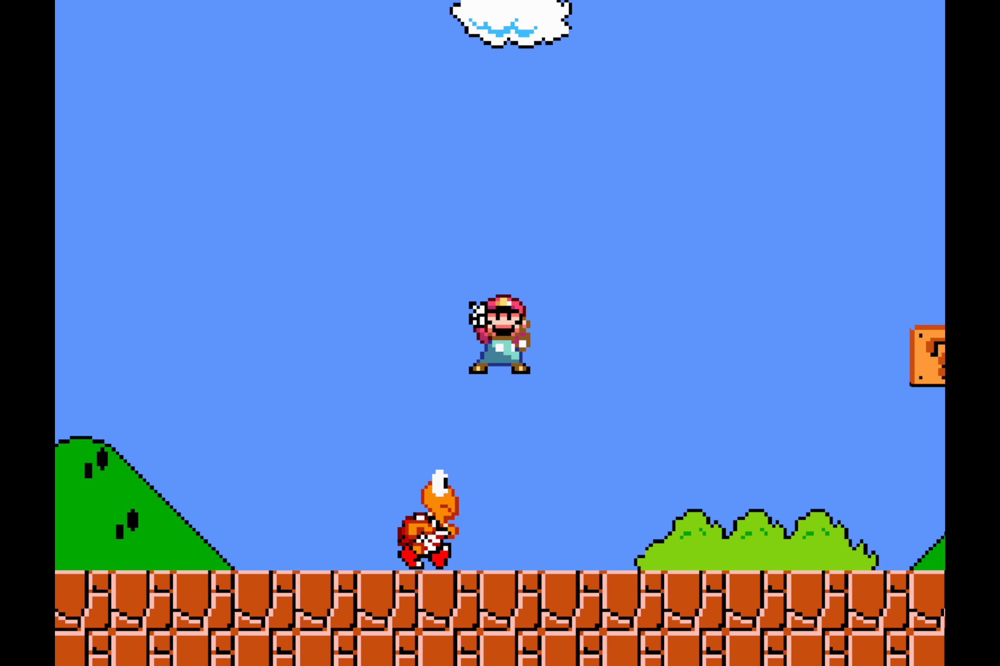
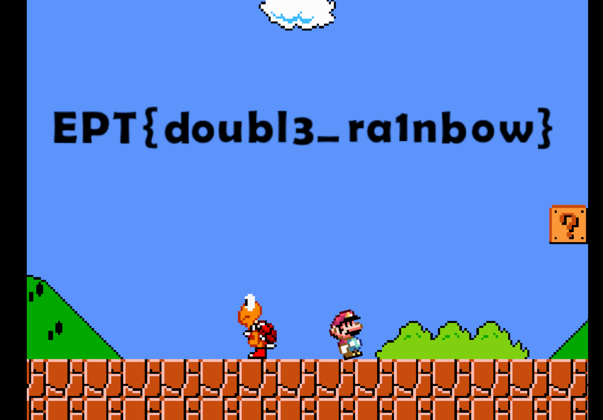

# Writeup: Broken Mario 2
Author: seal (seal524)

## Description
Category: reversing
```
Help!

My Mario game has been H A C K E D (AGAIN?!?!?!) :(  
How do I level UP now?  
Maybe I should just give up and die.
```
## Solution

This challenge hands out the files for the Unity game Broken Mario 2, a sequel to the EPT challenge Broken Mario from 2023. Upon first running this game it looks like a normal game but it has some weird controls. When you die to one of the Koopa Troopas you can quickly see that something weird is happening. There are two diffrent death cutscenes and there is something weird happening. This is teased in the description with the line `Maybe I should just give up and die`. 

### Cutscene 1 which shows a good death:

### Cutscene 2 which shows a bad death:


To start solving the challenge we first need to decompile `Assembly-CSharp.dll`. I used `dnSpy` for this.
When looking at the decompiled code we find a class called `GameManager`. here we find the two functions `PlayerHasDiedGood` and `PlayerHasDiedBad`.

```c#
	public void PlayerHasDiedGood()
	{
		GameManager.NextIndex++;
		this.ReloadCurrentScene();
	}

	public void PlayerHasDiedBad()
	{
		GameManager.Instance = null;
		GameManager.NextIndex = 0;
		this.ReloadCurrentScene();
	}
```

With a good death the value `GameManager.NextIndex` will increase and with a bad death the value will be reset to zero. So what decides if you have had a goood death or a bad one. Looking a bit more around the `GameManager` class there is the function `PlayerCollideWithEnemy`.
```c#
	public void PlayerCollideWithEnemy(MyPlayerController player, Enemy enemy)
	{
		if (GameManager.NextIndex >= this.Colors.Count)
		{
			return;
		}
		this._audioSource.Stop();
		if (enemy.CurrentEnemyColor == this.Colors[GameManager.NextIndex])
		{
			player.DieGood();
			return;
		}
		player.DieBad();
	}
```
The function calls `player.DieGood()` or `player.DieBad()` based on if `enemy.CurrentEnemyColor` equals `this.Colors[GameManager.NextIndex]` which uses the value increased in `PlayerHasDiedGood`.

`enemy.CurrentEnemyColor` reffers to the color the shell of the Koopa Troopas have. When looking at `Colors` in `GameManager` we can see it uses the enum `EnemyColor`.
```c#
GameManager:
	public List<EnemyColor> Colors;
...

EnemyColor:
public enum EnemyColor
{
	Red,
	Orange,
	Yellow,
	Green,
	Blue,
	Indigo,
	Violet
}
```
The enum shows the colors in a rainbow order which means what we will need to do is to die to the Koopa Troopa with a red shell first, the orange, yellow and so on. But there is a twist. when you reach the indigo shell you get a bad death and the game will reset. 
This is is because when you look at the Color map matching actual colors with the enum values the color mapped to Indigo: `Color(0.93f, 0.51f, 0.93f, 1f)` is actually way closer to Violet than Indigo. (You can put the colors into a rgb calculator by multiplying the values with 255). 
```c#
    private static readonly Dictionary<EnemyColor, Color> _colorMap = new Dictionary<EnemyColor, Color>
	{
		{
			EnemyColor.Red,
			Color.red
		},
		{
			EnemyColor.Orange,
			new Color(1f, 0.5f, 0f, 1f)
		},
		{
			EnemyColor.Yellow,
			Color.yellow
		},
		{
			EnemyColor.Green,
			Color.green
		},
		{
			EnemyColor.Blue,
			Color.blue
		},
		{
			EnemyColor.Indigo,
			new Color(0.93f, 0.51f, 0.93f, 1f)
		},
		{
			EnemyColor.Violet,
			new Color(0.29f, 0f, 0.51f, 1f)
		}
	};
```

Therefore the actual order of the shell you would need is: Red, Orange, Yellow, Green, Blue, Violet, Indigo. By then dying to all the Koopa Troopas in the right order, we get the flag: `EPT{doubl3_ra1nbow}`


Flag: `EPT{doubl3_ra1nbow}`